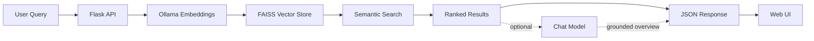

# AI Agent Discovery

A **privacy-first, semantic search engine** for discovering AI agents and tools. Built with modern AI/ML technologies including RAG (Retrieval-Augmented Generation), vector embeddings, and local LLMs.


## 🌟 Overview

AI Agent Discovery helps developers and researchers find the right AI agents for their needs using natural language queries. Instead of keyword matching, it uses semantic search powered by embeddings and vector databases to understand intent and return the most relevant results.

**Key Highlights:**
- 🔒 **100% Local & Private** - All embeddings and vector storage run locally using Ollama
- 🧠 **Semantic Search** - Natural language queries like "I need an agent to write Python code"
- 🎯 **Relevance Scored** - Every result carries a 0–1 score derived from vector distance
- 💬 **AI Overviews** - An optional local LLM explains which result fits your need, grounded only in what was retrieved
- 🎨 **Modern UI** - Clean, dark-themed interface inspired by developer tools
- 📊 **Rich Agent Database** - Curated collection of 243 AI agents, frameworks and developer tools

## 🚀 Features

### Intelligent Search
- **Natural Language Queries**: Describe what you need in plain English
- **Semantic Understanding**: Goes beyond keyword matching to understand intent
- **Relevance Ranking**: Results ranked by similarity using vector embeddings
- **Category Filtering**: Restrict results to Code Generation, Research, Automation, etc.
- **Browse by Technology**: `/tech/<name>` lists everything built on PyTorch, ROS 2, TypeScript — the question "what will this fit into", beside "what does it do"
- **Project Health**: Archived and dormant projects say so on the card, and **Only maintained projects** leaves them out of a search; an Atom feed tracks every catalogue change
- **AI Overviews**: A local chat model summarizes why the top results match, using only the retrieved agents
- **Shareable Searches**: The query and filter live in the URL, so results can be bookmarked and shared
- **Saved Searches**: Keep a question and see what changed about its answers — new matches, ones that dropped out, projects whose momentum moved
- **Result Caching**: Repeat queries are served from memory instead of re-embedding

### Privacy-Focused Architecture
- **Local LLM**: Powered by Ollama
- **Local Vector Store**: FAISS-based vector database stored locally
- **No Cloud Dependencies**: All processing happens on your machine
- **No Data Leaks**: Your queries never leave your computer

### Developer-Friendly
- **REST API**: Clean, JSON-only API endpoints for integration
- **CLI**: Search the index from the terminal without starting the server
- **Accessible**: Keyboard-operable filters, labelled controls, and live-announced results
- **JSON Data Format**: Easy to extend with your own agents
- **Docker**: One command brings up Ollama, seeding, and the app
- **Tested**: Python and frontend suites run in seconds without Ollama or FAISS installed

## 🛠️ Tech Stack

| Layer | Technology |
|-------|-----------|
| **Backend** | Python 3.10+, Flask |
| **AI/ML** | LangChain, Ollama, FAISS |
| **Frontend** | HTML5, CSS3, Vanilla JavaScript |
| **Testing** | pytest, vitest + jsdom, ruff, pre-commit |
| **Integrations** | MCP (Model Context Protocol) |
| **Data** | JSON, Vector Store (FAISS) |
| **Embeddings** | `nomic-embed-text` via Ollama (local) |

## 📋 Prerequisites

- **Python 3.10 or higher**
- **[Ollama](https://ollama.ai)** - For local inference
- **Git**

Or just **Docker**, which handles all of the above.

## 🔧 Installation & Setup

### Option A: Docker (quickest)

```bash
git clone https://github.com/vatsalp2008/AI-Agent-Discovery.git
cd AI-Agent-Discovery
make docker-up
```

This starts Ollama, pulls the embedding model, seeds the index, and serves the
app on **http://localhost:5000**.

### Option B: Local install

**1. Clone the repository**

```bash
git clone https://github.com/vatsalp2008/AI-Agent-Discovery.git
cd AI-Agent-Discovery
```

**2. Install Ollama & pull the models**

```bash
# Install Ollama from https://ollama.ai, then:
ollama pull nomic-embed-text   # embeddings
ollama pull llama3.2           # chat model
```

**3. Set up the Python environment**

```bash
python -m venv venv
source venv/bin/activate          # Windows: venv\Scripts\activate
make install                      # or: pip install -r ai-agent-discovery/requirements-dev.txt
```

**4. Configure environment variables (optional)**

Defaults work out of the box. To customise, copy the template:

```bash
cp ai-agent-discovery/.env.example ai-agent-discovery/.env
```

**5. Seed the index**

```bash
make seed        # or: python ai-agent-discovery/seed.py
```

**6. Run the application**

```bash
make run         # or: python ai-agent-discovery/frontend/app.py
```

The application starts on **http://localhost:5000**.

## ⚙️ Configuration

All settings are environment variables, read once in `backend/config.py`. Relative
paths resolve against the repository root, so commands work from any directory.

| Variable | Default | Purpose |
|----------|---------|---------|
| `OLLAMA_BASE_URL` | `http://localhost:11434` | Ollama server address |
| `EMBEDDING_MODEL` | `nomic-embed-text` | Model used to embed text |
| `MODEL_NAME` | `llama3.2` | Chat/generation model |
| `DATA_DIR` | `data` | Root for data files |
| `FAISS_DIR` | `data/faiss_index` | Where the index is persisted |
| `AGENTS_JSON` | `data/agents.json` | Agent catalogue |
| `SEARCH_DEFAULT_LIMIT` | `10` | Default result count |
| `SEARCH_MAX_LIMIT` | `50` | Upper bound on `limit` |
| `MAX_QUERY_LENGTH` | `500` | Longest accepted query |
| `AGENTS_PAGE_SIZE` | `50` | Default page size for `/api/agents` |
| `AGENTS_MAX_PAGE_SIZE` | `200` | Upper bound on that page size |
| `SEARCH_CACHE_SIZE` | `128` | Cached searches; `0` disables |
| `SEARCH_MIN_SCORE` | `0.5` | Below this, results are flagged as weak matches |
| `COMPARE_MAX_AGENTS` | `8` | Upper bound on `/api/compare` |
| `EMBEDDING_CACHE_SIZE` | `500` | Query embeddings kept on disk; `0` disables |
| `EMBEDDING_CACHE_PATH` | `data/embedding_cache.json` | Where they are stored |
| `ENABLE_ADMIN` | `false` | Catalogue editing — see the warning above |
| `DUPLICATE_SCORE` | `0.75` | Similarity above which a draft is flagged as a duplicate |
| `AUDIT_LOG_PATH` | `data/catalogue_audit.jsonl` | Record of catalogue edits |
| `LOG_FORMAT` | `text` | `text` or `json` (one object per line) |
| `HOST` / `PORT` | `127.0.0.1` / `5000` | Bind address |
| `FLASK_DEBUG` | `false` | Werkzeug debugger — see warning below |
| `RATE_LIMIT_SEARCHES` | `60` | Searches per minute per client; `0` disables |
| `RATE_LIMIT_SUMMARIES` | `20` | Summaries per minute per client; `0` disables |
| `ENABLE_SUMMARY` | `true` | Allow LLM-generated overviews |
| `SUMMARY_MAX_RESULTS` | `5` | Results sent to the chat model |
| `SUMMARY_MAX_TOKENS` | `220` | Length cap on a generated overview |
| `SUMMARY_TIMEOUT` | `30.0` | Seconds before generation is abandoned |
| `SUMMARY_TEMPERATURE` | `0.2` | Sampling temperature for overviews |
| `SLOW_REQUEST_MS` | `1000` | Requests at/above this are logged as slow |
| `LOG_LEVEL` | `INFO` | Logging verbosity |

> ⚠️ **Never enable `FLASK_DEBUG` on anything reachable by others.** The Werkzeug
> debugger exposes an interactive console that can execute arbitrary code.

## 🎯 Usage

### Pages

| Path | What it does |
|------|--------------|
| `/` | Search, with category chips, recent queries and export |
| `/dashboard` | Every agent, filterable and sortable, with totals |
| `/agent/<name>` | One agent in detail, plus similar agents |
| `/compare?names=A,B` | Up to eight agents side by side |
| `/collections` | Saved shortlists, kept in your browser |
| `/saved` | Searches worth re-running, with what changed since |
| `/changes` | How the catalogue has grown and been corrected |
| `/submit` | Propose an agent for review |
| `/category/<name>` | Everything in one category, most starred first |
| `/tech/<name>` | Everything built with one technology |
| `/admin` | Catalogue editor (needs `ENABLE_ADMIN=true`) |

### Web Interface

1. Open `http://localhost:5000`
2. Browse the agent previews, or enter a natural language query:
   - "I need an agent to write Python code"
   - "Find me a tool for automating workflows"
3. Start typing a name and matching agents are suggested — arrow keys and
   Enter to pick one. Submitting still runs a full semantic search, so the
   suggestions complement it rather than replace it
4. Click a category chip to restrict results to that category
5. Click an agent's name for its detail page, with similar agents
6. Use **Copy link** to share a search — the query and category live in the
   URL, so results are bookmarkable and survive the Back button
7. **Export CSV / JSON** to take a result set elsewhere, or **Save this
   search** to watch it — see below
8. Recent queries are remembered locally; they never leave your machine
9. Toggle light/dark in the header — the choice is saved, and the OS
   preference is honoured until you set one

Keyboard: <kbd>/</kbd> or <kbd>s</kbd> focuses search, <kbd>?</kbd> shows the
shortcut help, <kbd>Esc</kbd> closes it.

Everything is keyboard operable: the category chips are real buttons, the
results region announces updates, and a failed search offers a focused
**Try again** rather than making you retype.

The **saved searches**, **comparison** and **collections** pages each keep
something between visits. See **[docs/PAGES.md](docs/PAGES.md)** for what they
remember, how change detection decides what is worth reporting, and how export
and import move them between browsers.

### Command Line

```bash
python ai-agent-discovery/cli.py "an agent that writes python"
python ai-agent-discovery/cli.py "chatbot" --category "Customer Service" --limit 3
python ai-agent-discovery/cli.py --list
python ai-agent-discovery/cli.py --stats

# Filter and sort the catalogue
python ai-agent-discovery/cli.py --list --sort stars          # name | stars | category
python ai-agent-discovery/cli.py --list --tech Python --category "Code Generation"
python ai-agent-discovery/cli.py --tech-list                  # technologies with counts

# Drop weak matches instead of showing the closest guesses
python ai-agent-discovery/cli.py "banana bread" --min-score 0.5

# Add agents from a JSON file (an object or an array of them)
python ai-agent-discovery/cli.py --add new-agents.json --dry-run
python ai-agent-discovery/cli.py --add new-agents.json

# AI overview of the results, and machine-readable output
python ai-agent-discovery/cli.py "rag pipeline" --summarize
python ai-agent-discovery/cli.py "rag pipeline" --json | jq '.results[].name'
```

Run `--help` for the full list.

### API Endpoints

Every endpoint returns JSON, including errors.

| Method | Path | Purpose |
|--------|------|---------|
| `POST` | `/api/search` | Semantic search, optionally with an AI overview |
| `GET` | `/api/agents` | Paged agent list, filterable and sortable |
| `GET` | `/api/agents/<name>` | One agent |
| `GET` | `/api/agents/<name>/similar` | Its nearest neighbours |
| `GET` | `/api/compare?names=A,B` | Several agents at once |
| `GET` | `/api/categories`, `/api/tech` | Facets with counts |
| `GET` | `/api/changelog` | Catalogue history, newest first |
| `GET` | `/api/stats`, `/api/health` | Index summary and readiness |
| `GET` | `/api/openapi.json` | Machine-readable description |
| `*` | `/api/admin/*` | Catalogue editing (needs `ENABLE_ADMIN`) |

**[Full API reference →](docs/API.md)** — request and response shapes, what
`score` and `match` mean, weak-match handling, rate limits and response headers.

**Export** writes saved searches to a JSON file and **Import** merges one back,
so a backup or a move to another browser does not start over. On a clash the
local copy wins: its snapshot is the more recent baseline, and adopting an older
one would re-report changes already seen.

## 🔌 MCP Server

The catalogue is also available over [MCP](https://modelcontextprotocol.io), so
other AI agents can search it directly:

```bash
python ai-agent-discovery/mcp_server.py        # speaks MCP over stdio
```

The repo ships a `.mcp.json`, so an MCP client that reads it picks the server
up automatically. To register it with Claude Code by hand:

```bash
claude mcp add agent-discovery -- python /path/to/ai-agent-discovery/mcp_server.py
```

| Tool | What it does |
|------|--------------|
| `search_agents` | Natural-language search, with scores and a confidence flag |
| `get_agent` | One agent by name |
| `find_similar` | Neighbours of a named agent |
| `list_categories` | Categories with counts |
| `list_technologies` | Technologies with counts |
| `catalogue_stats` | Index summary |

The tools are read-only by design: an agent querying this should be able to
read the catalogue, not rewrite it. Results are trimmed to the fields a caller
needs, rather than the full record, to keep them cheap in a context window.

Trimmed, but not misleadingly: a result carries `status` when the project is
**archived** or **dormant** — a model recommending an abandoned tool without
knowing it was abandoned is the failure that field prevents. Healthy projects
say nothing, which is 204 of 223.

## 📥 Suggesting an Agent

Anyone can propose an agent at `/submit`, or by posting to `/api/submissions`.
A proposal is validated with the same rules as a direct edit, then queued —
nothing reaches the catalogue until a maintainer approves it, so the write
path stays as restricted as it was.

Maintainers review pending proposals at the top of `/admin`, with **Approve**
and **Reject**. Approving goes through the same write path as a direct add:
same validation, same lock, same audit entry. If the catalogue moved on and
the name has since been taken, approval fails and the proposal returns to
pending rather than being consumed.

Set `ENABLE_SUBMISSIONS=false` to close the queue. It is on by default —
unlike editing, a proposal is not a write.

## ✏️ Editing the Catalogue

`data/agents.json` can be hand-edited, but `/admin` does the same job with
validation and a clear error when something is wrong:

```bash
echo "ENABLE_ADMIN=true" >> ai-agent-discovery/.env
make run          # then open http://localhost:5000/admin
```

**Off by default on purpose.** It is the only part of the app that writes, and
it has no authentication, so enable it only on a localhost-bound `HOST`.

Edits go to `agents.json`; the index is rebuilt separately with the **Rebuild
index** button (or `make seed`), so a batch of edits costs one re-embed rather
than one per change. `/api/health` reports `catalogue_stale` when the index is
behind.

## 📁 Project Structure

```
AI-Agent-Discovery/
├── ai-agent-discovery/
│   ├── backend/
│   │   ├── api.py              # Flask routes and request validation
│   │   ├── config.py           # Environment and path resolution
│   │   ├── embeddings.py       # Ollama embeddings client
│   │   ├── logging_setup.py    # Shared logging configuration
│   │   ├── generation.py       # Optional LLM overview (the RAG step)
│   │   ├── models.py           # Agent dataclass
│   │   ├── rate_limit.py       # Per-client request budgets
│   │   ├── request_log.py      # Per-request timing
│   │   ├── scoring.py          # Distance to relevance score
│   │   ├── scraper.py          # Sample data and catalogue loading
│   │   ├── security.py         # CSP and other response headers
│   │   ├── admin.py            # Catalogue write API (flag-guarded)
│   │   ├── submissions.py      # Proposal queue awaiting review
│   │   ├── embedding_cache.py  # Persisted query embeddings
│   │   └── vectorstore.py      # FAISS index, search, caching
│   ├── frontend/
│   │   ├── app.py              # Flask application entry point
│   │   ├── static/css/style.css
│   │   ├── static/img/favicon.svg
│   │   ├── static/js/agent-card.js      # Shared card rendering
│   │   ├── static/js/search-state.js    # URL state and request shaping
│   │   ├── static/js/dashboard-stats.js # Stat formatting
│   │   ├── static/js/main.js            # Search page
│   │   ├── static/js/dashboard.js       # Dashboard page
│   │   ├── static/js/agent.js           # Agent detail page
│   │   ├── static/js/compare.js         # Comparison page
│   │   ├── static/js/theme.js           # Light/dark switching
│   │   ├── static/js/shortcuts.js       # Keyboard shortcuts
│   │   ├── static/js/recent-searches.js # Local query history
│   │   ├── static/js/export-results.js  # CSV and JSON export
│   │   ├── static/js/collections.js     # Saved shortlists
│   │   ├── static/js/admin.js           # Catalogue editor
│   │   ├── static/js/submit.js          # Proposal form
│   │   ├── static/js/ui.js              # Shared DOM helpers
│   │   ├── static/js/category.js        # Category browse page
│   │   ├── static/js/suggest.js         # Name suggestion ranking
│   │   ├── static/js/setup-banner.js    # Unbuilt-index notice
│   │   └── templates/          # base, index, dashboard, agent, compare
│   ├── .env.example            # Configuration template
│   ├── cli.py                  # Terminal search tool
│   ├── mcp_server.py           # MCP server for other agents
│   ├── benchmark.py            # Hot-path measurements
│   ├── doctor.py               # Setup diagnostics
│   ├── check_links.py          # Catalogue link checker
│   ├── refresh_stars.py        # Star count refresh
│   ├── discover.py             # Finds new agents on GitHub
│   ├── audit.py                # Flags entries that have gone stale
│   ├── requirements.txt        # Runtime dependencies
│   ├── requirements-dev.txt    # Plus pytest and ruff
│   └── seed.py                 # Index building script
├── data/
│   ├── agents.json             # Agent catalogue (source of truth)
│   └── faiss_index/            # Vector store (generated, gitignored)
├── tests/                      # Python test suite (pytest)
├── tests-js/                   # Frontend test suite (vitest + jsdom)
├── tests-live/                 # End-to-end tests against a real Ollama
├── .mcp.json                   # MCP server registration
├── .pre-commit-config.yaml
├── CONTRIBUTING.md
├── Dockerfile
├── docker-compose.yml
├── Makefile
└── README.md
```

## 🔍 How It Works

### Architecture Overview



### Retrieval-augmented generation

Retrieval and generation are deliberately separate. FAISS retrieves candidate
agents; the chat model is then given **only those agents** and asked to compare
them against what the user wanted. The prompt tells it to use nothing else and
not to invent tools or numbers, which keeps a small local model useful and
limits invention.

The web UI requests results first and the overview second, so you never wait on
the model to see your results. The second request re-uses the cached retrieval,
so it only pays for generation.

Generation never blocks retrieval: `backend/generation.py` returns `None` on any
failure. Set `ENABLE_SUMMARY=false` to turn it off entirely, in which case the
chat model is never contacted and `llama3.2` is not needed at all.

### Search Flow

1. **User Input**: User enters a natural language query
2. **Cache Check**: Identical recent queries return immediately
3. **Embedding Generation**: The query is converted to a vector using Ollama
4. **Vector Search**: FAISS finds the nearest agent embeddings
5. **Scoring & Filtering**: Distances become scores; category filters are applied
6. **Response**: Top results are returned with metadata
7. **Overview (optional)**: The retrieved agents are passed to the chat model,
   which writes a short grounded comparison

### Data Pipeline

1. **Seed Phase**: `seed.py` loads agents from `data/agents.json`
2. **Embedding**: Each agent description is embedded using Ollama
3. **Indexing**: Vectors are stored in the FAISS index, alongside an
   `index_meta.json` recording which embedding model built it
4. **Query**: User queries are embedded and matched against the index

Re-running `seed.py` **rebuilds** the index rather than appending, so repeated
runs are idempotent. Pass `--append` to add to an existing index instead.

## 🩺 Diagnosing setup problems

```bash
make doctor
```

Setup failures otherwise surface as confusing symptoms: an unreachable Ollama
looks like "no results", a missing model looks like a hang, and an index built
by a different embedding model looks like nonsense rankings. `doctor` checks
each of those and says what to do:

```
  [ok  ] ollama             reachable at http://localhost:11434
  [ok  ] embedding model    nomic-embed-text is installed
  [FAIL] index              built with 'llama3.2', but 'nomic-embed-text' is configured
         -> Run seed.py to rebuild it; vectors from one model are unusable by another.
```

It exits non-zero when something required is missing, so it can gate a script,
and `--json` emits the same results as data.

## 🔗 Keeping the catalogue current

Links rot, star counts drift, and new tools appear. Three commands cover it:

```bash
make check-links      # verify every URL still resolves
make refresh-stars    # update star counts from the GitHub API
make discover         # find agents the catalogue is missing
make audit            # flag entries that have gone stale
```

All three run on a schedule. See **[docs/CATALOGUE.md](docs/CATALOGUE.md)** for
what each one does, what the crawler refuses to propose and why, and how the
weekly workflows report their results.

## ⚡ Performance

```bash
make benchmark                                      # measure the hot paths
python ai-agent-discovery/benchmark.py --compare before.json   # after a change
python ai-agent-discovery/benchmark.py --scale 600  # a size we have not reached
```

Measured on an M-series laptop with 236 agents:

| Operation | Time | Note |
|-----------|------|------|
| `import vectorstore` | ~1ms | was ~485ms before imports were deferred |
| Build the store | ~355ms | pays the deferred FAISS import, on first request only |
| Search (uncached) | ~16ms | almost all of it is the Ollama embedding call |
| Search (filtered) | ~15ms | scans the whole index: +1.6ms at 2,000 agents, +7.4ms at 10,000 |
| Search (cached) | <0.1ms | in-memory, and persisted across restarts |
| `/api/agents`, `/api/stats` | <0.1ms | the agent list is memoized |

`--scale N` builds a throwaway index of N synthetic agents from the real
descriptions, to answer "what happens when this grows" before it does. At 600
agents — four times the current catalogue — search is still ~11ms and the
memoized lookups stay under a millisecond; only the one-off index build grows,
since it embeds every agent.

Three things make the difference:

- **Deferred imports.** `langchain_community.vectorstores` pulls in langsmith,
  about 300ms. Nothing needs it until a store is built, and that already waits
  for the first request that touches the index.
- **A persisted embedding cache.** Query embeddings depend only on the model
  and the text, so unlike results they never go stale — they survive restarts
  in `data/embedding_cache.json`.
- **ETags** on `/api/categories`, `/api/tech` and `/api/stats`, so a browser
  that already has the catalogue revalidates instead of re-downloading it.

## 🎨 Customization

### Adding Your Own Agents

`data/agents.json` is the source of truth — `seed.py` reads it and writes it
back, so your edits are preserved.

```json
{
  "name": "Your Agent",
  "description": "What it does...",
  "category": "Code Generation",
  "tech_stack": ["Python", "GPT-4"],
  "github_stars": 1000,
  "url": "https://github.com/...",
  "use_case": "Specific use case"
}
```

Then rebuild the index:

```bash
make seed
```

Unknown fields are ignored, so you can annotate records freely. If the file
is malformed, `seed.py` names the offending entry and exits non-zero rather
than failing with a traceback:

```
error: data/agents.json is not valid JSON: Illegal trailing comma before end
of object (line 1, column 19)
```

### Changing the Embedding Model

```bash
ollama pull mxbai-embed-large
echo "EMBEDDING_MODEL=mxbai-embed-large" >> ai-agent-discovery/.env
make seed        # required: vectors from one model are unusable by another
```

If you forget to re-seed, the app detects the mismatch and `/api/health`
reports it rather than returning nonsense results.

### Customizing the UI

- **Styles**: `ai-agent-discovery/frontend/static/css/style.css`
- **Shared layout**: `ai-agent-discovery/frontend/templates/base.html`
- **Pages**: `templates/index.html`, `dashboard.html`, `agent.html`
- **Card rendering**: `ai-agent-discovery/frontend/static/js/agent-card.js`
- **Search behaviour**: `ai-agent-discovery/frontend/static/js/main.js`
- **Response headers / CSP**: `ai-agent-discovery/backend/security.py`

Adding an inline `<script>` will be blocked by the Content-Security-Policy —
put it in a file under `static/js/` instead.

## 🧪 Development

```bash
make help          # list every target
make check         # lint + Python tests + frontend tests, as CI runs them
make verify        # all of the above, plus doctor, live tests and link checking
make test          # Python only
make test-js       # frontend only (needs: make install-js)
make test-live     # end-to-end against a real Ollama + seeded index
make lint
make fix           # apply autofixable lint findings
make refresh-stars # update GitHub star counts in data/agents.json
make clean         # drop caches and the generated index
```

The Python suite stubs out langchain and Ollama; the frontend suite runs in
jsdom. Neither needs a model installed, and both finish in seconds.

`make test-live` is separate and **not** part of `make check`: it exercises the
real embedding and chat models to catch what stubs cannot — that embeddings are
unit vectors, that scores actually separate relevant from irrelevant results,
and that generated overviews only mention agents that were actually retrieved.
It needs a running Ollama and a seeded index, and skips cleanly without them.

A separate scheduled workflow refreshes GitHub star counts weekly and opens a
pull request with the changes.

**CI** runs three jobs: the Python checks on 3.10 and 3.12, the frontend suite,
and a `live` job that starts an Ollama service container, pulls both models and
runs `tests-live` for real. That last job asserts the suite did not skip itself,
so a broken setup fails loudly instead of passing silently.

### Pre-commit hooks

```bash
pip install pre-commit
pre-commit install
```

Runs the same lint and tests CI does, plus whitespace and JSON checks and a
guard against committing the FAISS index (it is a pickle, and regenerable with
`make seed`). Every hook is `language: system`, so they use this project's
environment rather than a separately pinned copy that could disagree with
`requirements-dev.txt`.

See [CONTRIBUTING.md](CONTRIBUTING.md) for conventions and setup details.

### Testing the API

```bash
curl -X POST http://localhost:5000/api/search \
  -H "Content-Type: application/json" \
  -d '{"query": "code generation agent", "limit": 3}'

# With an AI overview (requires the chat model to be pulled)
curl -X POST http://localhost:5000/api/search \
  -H "Content-Type: application/json" \
  -d '{"query": "code generation agent", "limit": 3, "summarize": true}'

curl "http://localhost:5000/api/agents?limit=5"
curl "http://localhost:5000/api/agents?sort=stars&tech=Python"
curl http://localhost:5000/api/agents/Cursor
curl http://localhost:5000/api/categories
curl http://localhost:5000/api/tech
curl http://localhost:5000/api/stats
curl http://localhost:5000/api/health
```

## 🤝 Contributing

Contributions are welcome:

1. **Add More Agents**: Expand `data/agents.json`
2. **Improve Search**: Enhance ranking and filtering
3. **UI Enhancements**: Make the interface even better
4. **Documentation**: Improve docs and examples

Read [CONTRIBUTING.md](CONTRIBUTING.md) first, and make sure `make check` passes
before opening a pull request.

### Contribution Workflow

1. Fork the repository
2. Create a feature branch (`git checkout -b feature/amazing-feature`)
3. Commit your changes (`git commit -m 'Add amazing feature'`)
4. Push to the branch (`git push origin feature/amazing-feature`)
5. Open a Pull Request

## 📝 License

This project is licensed under the MIT License - see the [LICENSE](LICENSE) file for details.

## 🙏 Acknowledgments

- **Ollama** - For making local LLMs accessible
- **LangChain** - For the excellent LLM framework
- **FAISS** - For efficient vector similarity search
- **AI Agent Community** - For building amazing tools

## 📧 Contact

For questions or feedback, please open an issue on GitHub.

---

**Built with ❤️ for the AI agent community**
