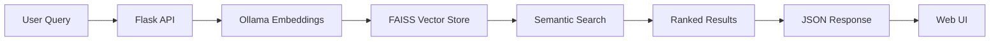

# AI Agent Discovery

A **privacy-first, semantic search engine** for discovering AI agents and tools. Built with modern AI/ML technologies including RAG (Retrieval-Augmented Generation), vector embeddings, and local LLMs.


## 🌟 Overview

AI Agent Discovery helps developers and researchers find the right AI agents for their needs using natural language queries. Instead of keyword matching, it uses semantic search powered by embeddings and vector databases to understand intent and return the most relevant results.

**Key Highlights:**
- 🔒 **100% Local & Private** - All embeddings and vector storage run locally using Ollama
- 🧠 **Semantic Search** - Natural language queries like "I need an agent to write Python code"
- 🎯 **Relevance Scored** - Every result carries a 0–1 score derived from vector distance
- 🎨 **Modern UI** - Clean, dark-themed interface inspired by developer tools
- 📊 **Rich Agent Database** - Curated collection of 20+ popular AI agents and frameworks

## 🚀 Features

### Intelligent Search
- **Natural Language Queries**: Describe what you need in plain English
- **Semantic Understanding**: Goes beyond keyword matching to understand intent
- **Relevance Ranking**: Results ranked by similarity using vector embeddings
- **Category Filtering**: Restrict results to Code Generation, Research, Automation, etc.
- **Result Caching**: Repeat queries are served from memory instead of re-embedding

### Privacy-Focused Architecture
- **Local LLM**: Powered by Ollama
- **Local Vector Store**: FAISS-based vector database stored locally
- **No Cloud Dependencies**: All processing happens on your machine
- **No Data Leaks**: Your queries never leave your computer

### Developer-Friendly
- **REST API**: Clean, JSON-only API endpoints for integration
- **CLI**: Search the index from the terminal without starting the server
- **JSON Data Format**: Easy to extend with your own agents
- **Docker**: One command brings up Ollama, seeding, and the app
- **Tested**: Test suite runs in under a second without Ollama or FAISS installed

## 🛠️ Tech Stack

| Layer | Technology |
|-------|-----------|
| **Backend** | Python 3.10+, Flask |
| **AI/ML** | LangChain, Ollama, FAISS |
| **Frontend** | HTML5, CSS3, Vanilla JavaScript |
| **Data** | JSON, Vector Store (FAISS) |
| **Embeddings** | `nomic-embed-text` via Ollama (local) |

## 📋 Prerequisites

- **Python 3.10 or higher**
- **[Ollama](https://ollama.ai)** - For local inference
- **Git**

Or just **Docker**, which handles all of the above.

## 🔧 Installation & Setup

### Option A: Docker (quickest)

```bash
git clone https://github.com/vatsalp2008/AI-Agent-Discovery.git
cd AI-Agent-Discovery
make docker-up
```

This starts Ollama, pulls the embedding model, seeds the index, and serves the
app on **http://localhost:5000**.

### Option B: Local install

**1. Clone the repository**

```bash
git clone https://github.com/vatsalp2008/AI-Agent-Discovery.git
cd AI-Agent-Discovery
```

**2. Install Ollama & pull the models**

```bash
# Install Ollama from https://ollama.ai, then:
ollama pull nomic-embed-text   # embeddings
ollama pull llama3.2           # chat model
```

**3. Set up the Python environment**

```bash
python -m venv venv
source venv/bin/activate          # Windows: venv\Scripts\activate
make install                      # or: pip install -r ai-agent-discovery/requirements-dev.txt
```

**4. Configure environment variables (optional)**

Defaults work out of the box. To customise, copy the template:

```bash
cp ai-agent-discovery/.env.example ai-agent-discovery/.env
```

**5. Seed the index**

```bash
make seed        # or: python ai-agent-discovery/seed.py
```

**6. Run the application**

```bash
make run         # or: python ai-agent-discovery/frontend/app.py
```

The application starts on **http://localhost:5000**.

## ⚙️ Configuration

All settings are environment variables, read once in `backend/config.py`. Relative
paths resolve against the repository root, so commands work from any directory.

| Variable | Default | Purpose |
|----------|---------|---------|
| `OLLAMA_BASE_URL` | `http://localhost:11434` | Ollama server address |
| `EMBEDDING_MODEL` | `nomic-embed-text` | Model used to embed text |
| `MODEL_NAME` | `llama3.2` | Chat/generation model |
| `DATA_DIR` | `data` | Root for data files |
| `FAISS_DIR` | `data/faiss_index` | Where the index is persisted |
| `AGENTS_JSON` | `data/agents.json` | Agent catalogue |
| `SEARCH_DEFAULT_LIMIT` | `10` | Default result count |
| `SEARCH_MAX_LIMIT` | `50` | Upper bound on `limit` |
| `MAX_QUERY_LENGTH` | `500` | Longest accepted query |
| `AGENTS_PAGE_SIZE` | `50` | Default page size for `/api/agents` |
| `AGENTS_MAX_PAGE_SIZE` | `200` | Upper bound on that page size |
| `SEARCH_CACHE_SIZE` | `128` | Cached searches; `0` disables |
| `HOST` / `PORT` | `127.0.0.1` / `5000` | Bind address |
| `FLASK_DEBUG` | `false` | Werkzeug debugger — see warning below |
| `LOG_LEVEL` | `INFO` | Logging verbosity |

> ⚠️ **Never enable `FLASK_DEBUG` on anything reachable by others.** The Werkzeug
> debugger exposes an interactive console that can execute arbitrary code.

## 🎯 Usage

### Web Interface

1. Open `http://localhost:5000`
2. Browse the agent previews, or enter a natural language query:
   - "I need an agent to write Python code"
   - "Find me a tool for automating workflows"
3. Click a category chip to restrict results to that category

### Command Line

```bash
python ai-agent-discovery/cli.py "an agent that writes python"
python ai-agent-discovery/cli.py "chatbot" --category "Customer Service" --limit 3
python ai-agent-discovery/cli.py --list
python ai-agent-discovery/cli.py --stats
```

### API Endpoints

Every endpoint returns JSON, including errors.

#### Search agents

```bash
POST /api/search
Content-Type: application/json

{
  "query": "I need an agent to write Python code",
  "limit": 5,                       # optional, 1..SEARCH_MAX_LIMIT
  "category": "Code Generation"     # optional, case-insensitive
}
```

**Response:**
```json
{
  "results": [
    {
      "name": "Cursor",
      "description": "Name: Cursor\nDescription: ...",
      "metadata": {
        "name": "Cursor",
        "category": "Code Generation",
        "stack": "Electron,GPT-4,VS Code",
        "stars": 35000,
        "description": "An AI-powered code editor...",
        "url": "https://cursor.sh"
      },
      "distance": 0.42,
      "score": 0.7042
    }
  ],
  "metadata": { "count": 1, "limit": 5, "category": "Code Generation", "duration": "0.08s" }
}
```

`score` is `1 / (1 + distance)`, so it lands in `[0, 1]` with 1.0 being an exact match.

#### List agents (paginated)

```bash
GET /api/agents?limit=20&offset=0
```

```json
{
  "agents": [ { "name": "Aider", "description": "...", "metadata": { } } ],
  "metadata": { "total": 21, "count": 20, "limit": 20, "offset": 0, "has_more": true }
}
```

#### Get a single agent

```bash
GET /api/agents/Cursor      # case-insensitive; 404 if unknown
```

#### List categories

```bash
GET /api/categories
# [{"name": "Code Generation", "count": 6}, {"name": "Research", "count": 4}]
```

#### Statistics

```bash
GET /api/stats
# {"count": 21, "categories": 8, "top_category": {"name": "Code Generation", "count": 6},
#  "total_stars": 653000, "average_stars": 31095, "embedding_model": "nomic-embed-text"}
```

#### Health

```bash
GET /api/health
```

Returns `200` when the index is usable, and `503` with a `detail` explaining why
when it is not — unseeded, unreachable, or built by a different embedding model.

## 📁 Project Structure

```
AI-Agent-Discovery/
├── ai-agent-discovery/
│   ├── backend/
│   │   ├── api.py              # Flask routes and request validation
│   │   ├── config.py           # Environment and path resolution
│   │   ├── embeddings.py       # Ollama embeddings client
│   │   ├── logging_setup.py    # Shared logging configuration
│   │   ├── models.py           # Agent dataclass
│   │   ├── scoring.py          # Distance to relevance score
│   │   ├── scraper.py          # Sample data and catalogue loading
│   │   └── vectorstore.py      # FAISS index, search, caching
│   ├── frontend/
│   │   ├── app.py              # Flask application entry point
│   │   ├── static/css/style.css
│   │   ├── static/js/agent-card.js   # Shared card rendering
│   │   ├── static/js/main.js         # Search page
│   │   ├── static/js/dashboard.js    # Dashboard page
│   │   └── templates/          # index.html, dashboard.html
│   ├── .env.example            # Configuration template
│   ├── cli.py                  # Terminal search tool
│   ├── requirements.txt        # Runtime dependencies
│   ├── requirements-dev.txt    # Plus pytest and ruff
│   └── seed.py                 # Index building script
├── data/
│   ├── agents.json             # Agent catalogue (source of truth)
│   └── faiss_index/            # Vector store (generated, gitignored)
├── tests/                      # Test suite
├── Dockerfile
├── docker-compose.yml
├── Makefile
└── README.md
```

## 🔍 How It Works

### Architecture Overview



### Search Flow

1. **User Input**: User enters a natural language query
2. **Cache Check**: Identical recent queries return immediately
3. **Embedding Generation**: The query is converted to a vector using Ollama
4. **Vector Search**: FAISS finds the nearest agent embeddings
5. **Scoring & Filtering**: Distances become scores; category filters are applied
6. **Response**: Top results are returned with metadata

### Data Pipeline

1. **Seed Phase**: `seed.py` loads agents from `data/agents.json`
2. **Embedding**: Each agent description is embedded using Ollama
3. **Indexing**: Vectors are stored in the FAISS index, alongside an
   `index_meta.json` recording which embedding model built it
4. **Query**: User queries are embedded and matched against the index

Re-running `seed.py` **rebuilds** the index rather than appending, so repeated
runs are idempotent. Pass `--append` to add to an existing index instead.

## 🎨 Customization

### Adding Your Own Agents

`data/agents.json` is the source of truth — `seed.py` reads it and writes it
back, so your edits are preserved.

```json
{
  "name": "Your Agent",
  "description": "What it does...",
  "category": "Code Generation",
  "tech_stack": ["Python", "GPT-4"],
  "github_stars": 1000,
  "url": "https://github.com/...",
  "use_case": "Specific use case"
}
```

Then rebuild the index:

```bash
make seed
```

Unknown fields are ignored, so you can annotate records freely.

### Changing the Embedding Model

```bash
ollama pull mxbai-embed-large
echo "EMBEDDING_MODEL=mxbai-embed-large" >> ai-agent-discovery/.env
make seed        # required: vectors from one model are unusable by another
```

If you forget to re-seed, the app detects the mismatch and `/api/health`
reports it rather than returning nonsense results.

### Customizing the UI

- **Styles**: `ai-agent-discovery/frontend/static/css/style.css`
- **Layout**: `ai-agent-discovery/frontend/templates/index.html`
- **Card rendering**: `ai-agent-discovery/frontend/static/js/agent-card.js`
- **Search behaviour**: `ai-agent-discovery/frontend/static/js/main.js`

## 🧪 Development

```bash
make help        # list every target
make check       # lint + tests, exactly what CI runs
make test
make lint
make fix         # apply autofixable lint findings
make clean       # drop caches and the generated index
```

The test suite stubs out langchain and Ollama, so it runs in well under a
second and needs no models installed. CI runs the same checks on Python 3.10
and 3.12.

### Testing the API

```bash
curl -X POST http://localhost:5000/api/search \
  -H "Content-Type: application/json" \
  -d '{"query": "code generation agent", "limit": 3}'

curl "http://localhost:5000/api/agents?limit=5"
curl http://localhost:5000/api/agents/Cursor
curl http://localhost:5000/api/categories
curl http://localhost:5000/api/stats
curl http://localhost:5000/api/health
```

## 🤝 Contributing

Contributions are welcome:

1. **Add More Agents**: Expand `data/agents.json`
2. **Improve Search**: Enhance ranking and filtering
3. **UI Enhancements**: Make the interface even better
4. **Documentation**: Improve docs and examples

Please make sure `make check` passes before opening a pull request.

### Contribution Workflow

1. Fork the repository
2. Create a feature branch (`git checkout -b feature/amazing-feature`)
3. Commit your changes (`git commit -m 'Add amazing feature'`)
4. Push to the branch (`git push origin feature/amazing-feature`)
5. Open a Pull Request

## 📝 License

This project is licensed under the MIT License - see the [LICENSE](LICENSE) file for details.

## 🙏 Acknowledgments

- **Ollama** - For making local LLMs accessible
- **LangChain** - For the excellent LLM framework
- **FAISS** - For efficient vector similarity search
- **AI Agent Community** - For building amazing tools

## 📧 Contact

For questions or feedback, please open an issue on GitHub.

---

**Built with ❤️ for the AI agent community**
