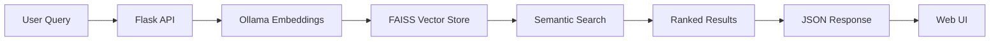

# AI Agent Discovery

A **privacy-first, semantic search engine** for discovering AI agents and tools. Built with modern AI/ML technologies including RAG (Retrieval-Augmented Generation), vector embeddings, and local LLMs.


## 🌟 Overview

AI Agent Discovery helps developers and researchers find the right AI agents for their needs using natural language queries. Instead of keyword matching, it uses semantic search powered by embeddings and vector databases to understand intent and return the most relevant results.

**Key Highlights:**
- 🔒 **100% Local & Private** - All embeddings and vector storage run locally using Ollama
- 🧠 **Semantic Search** - Natural language queries like "I need an agent to write Python code"
- 🎯 **RAG-Powered** - Uses Retrieval-Augmented Generation for intelligent ranking
- 🎨 **Modern UI** - Clean, dark-themed interface inspired by developer tools
- 📊 **Rich Agent Database** - Curated collection of 20+ popular AI agents and frameworks

## 🚀 Features

### Intelligent Search
- **Natural Language Queries**: Describe what you need in plain English
- **Semantic Understanding**: Goes beyond keyword matching to understand intent
- **Relevance Ranking**: Results ranked by similarity using vector embeddings
- **Category Filtering**: Browse by Code Generation, Research, Automation, etc.

### Privacy-Focused Architecture
- **Local LLM**: Powered by Ollama (Llama 3.2 or Mistral)
- **Local Vector Store**: FAISS-based vector database stored locally
- **No Cloud Dependencies**: All processing happens on your machine
- **No Data Leaks**: Your queries never leave your computer

### Developer-Friendly
- **REST API**: Clean API endpoints for integration
- **JSON Data Format**: Easy to extend with your own agents
- **Modern Tech Stack**: Flask, LangChain, FAISS, Ollama
- **Responsive Design**: Works on desktop and mobile

## 🛠️ Tech Stack

| Layer | Technology |
|-------|-----------|
| **Backend** | Python 3.10+, Flask |
| **AI/ML** | LangChain, Ollama (Llama 3.2), FAISS |
| **Frontend** | HTML5, CSS3, Vanilla JavaScript |
| **Data** | JSON, Vector Store (FAISS) |
| **Embeddings** | Ollama Embeddings (local) |

## 📋 Prerequisites

Before you begin, ensure you have the following installed:

- **Python 3.10 or higher**
- **[Ollama](https://ollama.ai)** - For local LLM inference
- **Git** - For cloning the repository

## 🔧 Installation & Setup

### 1. Clone the Repository

```bash
git clone https://github.com/yourusername/AI-Agent-Discovery.git
cd AI-Agent-Discovery
```

### 2. Install Ollama & Pull Model

```bash
# Install Ollama from https://ollama.ai
# Then pull the required model
ollama pull llama3.2

# Alternative: use mistral
# ollama pull mistral
```

### 3. Set Up Python Environment

```bash
# Navigate to the project directory
cd ai-agent-discovery

# Create virtual environment
python -m venv venv

# Activate virtual environment
# On macOS/Linux:
source venv/bin/activate
# On Windows:
# venv\Scripts\activate

# Install dependencies
pip install -r requirements.txt
```

### 4. Configure Environment Variables

Create a `.env` file in the `ai-agent-discovery` directory:

```env
OLLAMA_BASE_URL=http://localhost:11434
MODEL_NAME=llama3.2
```

### 5. Seed the Database

Populate the vector database with sample AI agents:

```bash
python seed.py
```

This will:
- Load agents from `../data/agents.json`
- Generate embeddings using Ollama
- Store vectors in FAISS index at `../data/faiss_index`

### 6. Run the Application

```bash
python frontend/app.py
```

The application will start on **http://localhost:5000**

## 🎯 Usage

### Web Interface

1. Open your browser to `http://localhost:5000`
2. Enter a natural language query like:
   - "I need an agent to write Python code"
   - "Find me a tool for automating workflows"
   - "Show me research agents for document analysis"
3. View ranked results with agent details, tech stack, and links

### API Endpoints

#### Search Agents
```bash
POST /api/search
Content-Type: application/json

{
  "query": "I need an agent to write Python code"
}
```

**Response:**
```json
{
  "results": [
    {
      "name": "Cursor",
      "description": "An AI-powered code editor...",
      "category": "Code Generation",
      "tech_stack": ["Electron", "GPT-4", "VS Code"],
      "github_stars": 35000,
      "url": "https://cursor.sh",
      "use_case": "Code editing, refactoring, generation",
      "score": 0.89
    }
  ],
  "count": 5
}
```

#### List All Agents
```bash
GET /api/agents
```

#### Get Statistics
```bash
GET /api/stats
```

## 📁 Project Structure

```
AI-Agent-Discovery/
├── ai-agent-discovery/
│   ├── backend/
│   │   ├── api.py              # Flask API routes
│   │   ├── embeddings.py       # Ollama embeddings wrapper
│   │   ├── models.py           # Pydantic models
│   │   ├── scraper.py          # Sample data definitions
│   │   └── vectorstore.py      # FAISS vector store logic
│   ├── frontend/
│   │   ├── app.py              # Flask application entry point
│   │   ├── static/             # CSS and JavaScript
│   │   └── templates/          # HTML templates
│   ├── .env                    # Environment configuration
│   ├── requirements.txt        # Python dependencies
│   └── seed.py                 # Database seeding script
├── data/
│   ├── agents.json             # Agent database
│   └── faiss_index/            # Vector store (generated)
└── README.md                   # This file
```

## 🔍 How It Works

### Architecture Overview



### Search Flow

1. **User Input**: User enters natural language query
2. **Embedding Generation**: Query is converted to vector using Ollama
3. **Vector Search**: FAISS finds most similar agent embeddings
4. **Ranking**: Results ranked by cosine similarity
5. **Response**: Top results returned with metadata

### Data Pipeline

1. **Seed Phase**: `seed.py` loads agents from JSON
2. **Embedding**: Each agent description is embedded using Ollama
3. **Indexing**: Vectors stored in FAISS index
4. **Query**: User queries are embedded and matched against index

## 🎨 Customization

### Adding Your Own Agents

Edit `data/agents.json`:

```json
{
  "name": "Your Agent",
  "description": "What it does...",
  "category": "Code Generation",
  "tech_stack": ["Python", "GPT-4"],
  "github_stars": 1000,
  "url": "https://github.com/...",
  "use_case": "Specific use case"
}
```

Then re-run the seed script:
```bash
python seed.py
```

### Changing the LLM Model

Update `.env`:
```env
MODEL_NAME=mistral  # or any other Ollama model
```

### Customizing the UI

- **Styles**: Edit `frontend/static/style.css`
- **Layout**: Edit `frontend/templates/index.html`
- **Behavior**: Edit `frontend/static/script.js`

## 🧪 Development

### Running in Development Mode

```bash
# Enable Flask debug mode
export FLASK_ENV=development
python frontend/app.py
```

### Testing the API

```bash
# Test search endpoint
curl -X POST http://localhost:5000/api/search \
  -H "Content-Type: application/json" \
  -d '{"query": "code generation agent"}'

# Test list endpoint
curl http://localhost:5000/api/agents

# Test stats endpoint
curl http://localhost:5000/api/stats
```

## 🤝 Contributing

Contributions are welcome! Here's how you can help:

1. **Add More Agents**: Expand the agent database
2. **Improve Search**: Enhance ranking algorithms
3. **UI Enhancements**: Make the interface even better
4. **Documentation**: Improve docs and examples

### Contribution Workflow

1. Fork the repository
2. Create a feature branch (`git checkout -b feature/amazing-feature`)
3. Commit your changes (`git commit -m 'Add amazing feature'`)
4. Push to the branch (`git push origin feature/amazing-feature`)
5. Open a Pull Request

## 📝 License

This project is licensed under the MIT License - see the LICENSE file for details.

## 🙏 Acknowledgments

- **Ollama** - For making local LLMs accessible
- **LangChain** - For the excellent LLM framework
- **FAISS** - For efficient vector similarity search
- **AI Agent Community** - For building amazing tools

## 📧 Contact

For questions or feedback, please open an issue on GitHub.

---

**Built with ❤️ for the AI agent community**
